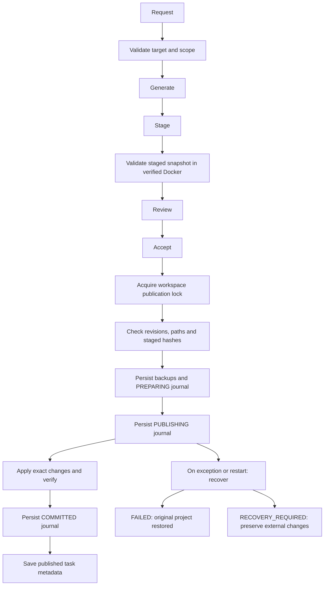

# Reviewed publication and recovery

The authoritative code publication controller is `CodingWorkspace` in `workflows/coding_workspace.py`. `workflows/publication_journal.py` supplies journal persistence, recovery and an OS advisory lock. Generated code and Agent file organization stage outside canonical project files. Docker executes a snapshot; the container cannot publish canonical changes. Accept remains an explicit review gate. Chat code responses do not authorize project mutation.



## Preconditions and authority

`accept()` requires a completed staged result, a successful container execution marker and available validated staged bytes. A Docker-unavailable draft can be retained for review but cannot publish. Existing file revisions and staged SHA-256 hashes are checked before preparation and again during application. Planned file paths and directory removal contents are checked. Linked paths and junctions are rejected. Missing, stale or source-mismatched sandbox attestation blocks the backend execution path.

`publication_state` retains the existing UI values `staged`, `published`, `discarded` and `recovery_required`. `publication_transaction_state` records the separate durable transaction state. The journal uses lowercase `preparing`, `publishing`, `committed`, `failed` and `recovery_required`. A container execution marker alone is not the transaction state or proof of publication.

## Journal and recovery

Journal attempts live under workspace metadata at `coding-workspaces/<workspace-id>/pub/<task-id>/<attempt>/`, outside canonical files. Each journal binds the exact project root, workspace identity and task identity. It records the operation (`accept` or `undo`), sequence, relative paths, actions, before hashes, accepted hashes and backup locations. Existing bytes are backed up before canonical writes. Implicit parent directory creation becomes explicit journaled `mkdir` operations.

Backups and journal JSON are written to exclusive temporary files, flushed, passed through `os.fsync()`, then atomically replaced. Canonical replacement content is also flushed and synced before replacement. Successful publication verifies accepted bytes and persists `committed` before saving the task result. A crash after commit but before result metadata therefore has a committed record from which metadata can be reconstructed.

Atomic journal writes use short, exclusively created sibling temporary filenames. A live Windows benchmark exposed destination-derived UUID names exceeding the host path limit even when the destination was valid; a deep-metadata-path regression now covers that case. This does not claim support for every path beyond Windows filesystem limits.

On startup, existing journal attempts are recovered in recorded sequence under the workspace lock. The same scan precedes guarded project mutations. Before recovery can alter canonical bytes, the entire workspace's journal identity, entry schema and associated task metadata are preflighted. Missing, malformed or inaccessible recovery metadata quarantines that workspace: evidence remains intact, guarded mutations fail closed, and workspace GET/list exposes `publication_recovery` with intervention errors. Healthy workspaces remain usable and backend startup continues. Quarantine is reconstructed from the preserved evidence on restart; no automatic force-repair deletes it.

A `preparing` journal represents preparation before any canonical write and becomes `failed`. A `publishing` journal rolls back in reverse operation order. A file already matching its original hash needs no change; a file matching the transaction's exact accepted hash may be restored from a verified backup. Unexpected current bytes are preserved and recorded as conflicts. A created directory is removed only if empty. A removed directory is recreated only when its path and existing parent are safe. Recovery is idempotent. Committed attempts are never rolled back.

Ordinary publication exceptions use this recovery path rather than unconditional overwrite rollback. Undo prepares a new durable reverse transaction after checking current published revisions and original backup hashes. It includes implicit directories recorded by the accepted transaction.

`recovery_required` preserves the staged draft, backups and journal and blocks guarded project mutations. User intervention must compare the current external bytes, accepted bytes and original backup, decide which content to retain, and resolve the conflicting state before retrying. There is no automatic force-overwrite or UI recovery wizard. Reads remain available. Do not delete journals or backups to suppress a conflict.

## Lock scope and external writers

The in-process `RLock` serializes instance operations. The OS advisory lock is keyed to the workspace metadata directory; its lock file is outside canonical files and outside execution input. Accept, undo, writes, imports, file operations, terminal synchronization and project deletion use the shared guarded mutation path. Nested mutations reuse the already held lock.

This lock coordinates cooperating SovereignAI processes referring to the same workspace metadata. It does not lock VS Code, PowerShell or other host applications, nor coordinate different metadata roots pointing at one physical project. Repeated revision checks detect many external edits, and recovery preserves detected newer changes. Host permissions and backups remain relevant operational boundaries.

## Exact guarantees and limitations

The implementation supports recovery from process interruption using durable transaction records and guarded rollback. It does not make all files atomically visible as one filesystem operation: an external reader can observe intermediate canonical files during publication. A crash can leave partial files until recovery runs.

Windows portable Python does not supply directory-entry `fsync()` here. Atomic replacement and file-content `fsync()` are not an unconditional power-loss guarantee across Windows, NTFS, device write caches and directory updates. POSIX journal writes additionally sync the parent directory. No storage certification or forced-power-loss test is claimed.

Path/reparse checks and byte comparisons precede OS operations but are not a host compare-and-swap. An uncooperative host writer can change a file or swap a parent after checking and before reading, replacing or deleting. Handle-based Windows operations and suitable OS sharing/rename semantics would be needed for a stronger guarantee. The advisory lock and current tests do not eliminate this TOCTOU interval.

Manual Code edits, terminal synchronization and Knowledge document mutations retain their own user-authorized flows; Docker validation of AI changes is not a blanket validation of those workflows. The staged file-organization smoke run validates acceptance of the planned snapshot, not every behavior of unchanged source.

## Verification

Focused tests cover interrupted partial publication followed by restart and retry, commit/result-metadata reconstruction, external edits during a later publication failure, mutation blocking on conflicts, exact backup verification, cooperating lock contention, path rejection, directory conflict preservation and durable undo. Eight corruption cases cover missing task metadata, malformed task JSON, malformed journal JSON and malformed entry schema in both committed and interrupted publishing states. They preserve canonical bytes and malformed evidence while a healthy workspace remains writable. The journal suite independently passed 24 tests; the final journal/publication subset passed 37 tests. These are process-interruption and injected-failure tests, not live power-loss or universal host-race proof.

```powershell
.app-venv\Scripts\python.exe -m pytest tests/test_publication_journal.py tests/test_publication_boundary.py tests/test_coding_project.py tests/test_terminal_project_sync.py tests/test_host_projects.py tests/test_project_migration_concurrency.py tests/test_sandbox_project_assets.py -q
```
