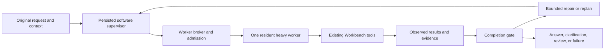

# Universal Task Agent: implementation and provisional verification report

Status: 1 October 2026. The software supervisor, worker broker, completion observations, and isolated comparison harness are implemented. Live diagnostics exposed missing source context, false intermediate-stage vetoes, and an inherited structured-output thinking default. Generic corrections pass regression and the narrow live source check; the full 128-fixture × 3-strategy comparison is next. This document does not claim universal correctness, model retraining, or superiority of one strategy before the comparison finishes.

## 1. Architecture summary

The Universal Task Agent is software orchestration around existing Workbench workflows. It is not another permanently resident language model. It preserves the original request, records operational state, selects a worker, executes the existing tools, observes their results, and evaluates completion. Repairs and replanning have bounded budgets. Existing tools remain responsible for calculation, document retrieval, table execution, project staging, validation, and publication.



Observation-driven execution is supported by the [ReAct research](https://arxiv.org/abs/2210.03629), but that research is not evidence that this local implementation works perfectly. [Toolformer](https://arxiv.org/abs/2302.04761) studies model training for tool use; this project has not trained its worker weights. [llama.cpp grammar constraints](https://github.com/ggml-org/llama.cpp/blob/master/grammars/README.md) constrain output syntax, not semantic truth. [RouteLLM](https://arxiv.org/abs/2406.18665) motivates measured routing; its results do not establish performance for these local models or this laptop.

## 2. Files changed and implementation boundaries

The principal implementation is in [request normalization](../router/request_normalization.py), [model broker](../router/model_broker.py), [task supervisor](../backend/task_supervisor.py), [completion observations](../router/task_completion.py), and the integration in [Workbench service](../backend/service.py). Existing registry, executor, project review, validation, and publication paths retain their authority.

Evaluation files are [live/replay comparison harness](../benchmarks/evaluate-universal-agent.py), [frozen fixtures](../benchmarks/universal-agent-fixtures.json), [fixture manifest](../benchmarks/universal-agent-fixtures.manifest.json), [methodology](../benchmarks/universal-agent-benchmark.md), and [benchmark tests](../tests/test_universal_agent_benchmark.py). The tiny-controller experiment is canonical under [experimental/benchmark](../experimental/benchmark/README.md), [experimental/tiny_controller](../experimental/tiny_controller/README.md), and `experimental/results`. The old `benchmarks/evaluate-micro-controller.py` entry point remains a compatibility wrapper.

This is an architectural inventory, not an assertion that every listed file was authored in this final documentation step. Use the repository diff for the exact change set.

## 3. Model lifecycle behavior

Worker roles are lightweight text, reasoning text, coding, and vision. The installed worker identities are resolved through registry metadata and runtime observations rather than trusting a display label. The intended installed families include Gemma 4 E2B, Qwen reasoning, Qwen 2.5 Coder 3B, and the installed vision worker; current configuration and actual served identity are the authority for each run.

Acquisition passes through the existing single-server lease machinery. Before a swap, operational task state is checkpointed. An owned resident worker can be unloaded before the next is admitted. CPU embeddings remain separate from the heavy generative worker. The benchmark runs strategies sequentially and does not preload a second candidate. The launcher accepts a verified owned registered runtime profile rather than requiring the text alias: a real warm Gemma process was observed ready without a swap, with one actual worker PID.

## 4. Routing behavior

Normalization produces a hypothesis alongside the original request. Its small correction dictionary protects quoted strings, code, paths, URLs, email addresses, and identifiers; it does not rewrite file names or IDs. Explicit file-edit authority and source-language markers can select coding. Image requests select vision. Strict greetings and narrowly defined simple read-only questions can use the lightweight worker. Ambiguous requests, document tasks, and more demanding requests use reasoning.

The model still interprets the task and plans permitted operations. These generic routing rules are not task-specific substitutions for understanding a user's spreadsheet or code request. Follow-up coding classification can consider prior user context, while selected workspace and knowledge scope must remain explicit execution context.

Comparison strategies are A: fixed reasoning plus coding specialist; B: always reasoning for non-vision tasks; C: universal role selection. The same frozen requests and independent oracles are used across strategies. A/B/C are experimental harness strategies, not new user-facing approval modes.

## 5. Task-state behavior

Persisted state includes original and normalized request, conversation and follow-up context, intent, workflow, modality, workspace, knowledge scope, requested deliverables, success conditions, plan, current action and stage, active worker, observations, tool results, evidence, repair and replan counts, blockers, cancellation, and timestamps.

Stages cover receipt, normalization, understanding, planning, routing, resource waiting, execution, observation, verification, repair, replanning, user input, review readiness, completion, failure, cancellation, and unverified outcomes. Terminal states prevent later transitions. State is atomically persisted under the configured data directory's `supervision` directory. Bounded operational events omit hidden chain-of-thought.

Default limits are 64 model calls, 12 tool calls, 4 model switches, and 900 seconds. Cancellation and elapsed-time checks occur at cooperative checkpoints. These budgets prevent an unbounded “keep trying” loop; they cannot make every external blocking call instantly interruptible.

## 6. Model broker behavior

The broker applies capability, modality, context, asset, enabled-state, license/runtime, resource, and worker-role admission before preference ranking. It resolves legacy aliases to a real model identity. Rejected candidates carry rejection reasons; an ineligible model is not silently substituted for a specialist.

Selection is lexicographic rather than an unvalidated weighted score. Quality or latency comparisons apply only when eligible candidates have comparable measured evidence. Task affinity, verified warm residency, comparable measured switching cost, and stable identity ordering then guide selection. Missing measurements remain unknown. Acquisition rechecks the decision under the existing lease lock.

## 7. One-model residency proof and its limits

The enforced design boundary is the existing registry's single heavy-worker lease, with serialized acquisition and owned-process lifecycle control. Broker tests verify admission, identity, affinity, and switching behavior. The live harness can additionally sample actual llama process count, RAM, and GPU memory once per second.

A live sequence loaded Gemma, Qwen Coder, Qwen reasoning, Qwen vision, and Gemma again. Each ready-worker observation found one `llama-server` process and the same persisted task ID and original goal. Actual model identities, PIDs, timings and counters are in [runtime lease observations](../benchmarks/universal-runtime-leases.json). This verifies ready-state observations and checkpoint continuity, not continuous sampling of every transition. Full-run resource measurements remain pending. Total GPU memory includes other applications; unavailable peaks remain unknown.

## 8. Completion gate behavior

`observe_completion` separates delivered text from achieved execution. Concrete failed checks and nonzero exit codes fail the observed contract. Cancellation stays cancelled. Staged or recovery-required project changes remain awaiting review. Missing evidence and clarification needs remain needs-input or unverified.

Completion can be established by observed executor contracts: successful execution, actual test/runtime checks, committed publication revision, deterministic calculation, verified table presentation, or delivery under the explicit simple-conversation contract. Syntax checking alone does not prove runtime behavior. Even a completed contract includes a limitation that universal semantic correctness has not been established.

Code may be successfully generated and validated while remaining staged. The benchmark records that artifact evidence separately and does not count it as published user-goal completion.

## 9. Security and publication invariants

Retrieved documents and pasted source content are evidence, not authorization to execute their instructions. The original user request and selected workspace constrain the plan. Destructive operations require actual user authorization. Model assertions, valid JSON, and a successful planning call do not authorize publication.

The project workflow preserves staging, validation, explicit review/acceptance, revision checking, and publication. The supervisor does not add automatic acceptance. Unavailable validation remains a blocker rather than a successful check. Benchmark workspaces, documents, images, and tests are fixture-owned temporary resources; the harness does not accept or publish changes to user projects.

## 10. Benchmark results

The universal pilot contains 128 engineer-authored cases across 16 categories: simple requests, noisy spelling, general questions, RAG, tables, calculation, coding, vision, follow-ups, task changes, ambiguity, Docker failure, repairs, completion checks, cancellation, and resource switching. It is frozen with semantic SHA-256 `af943758778eb08de4d351611ab7488737c1a92a82c947e932c85be0c9da839a`. It is not an independent held-out user dataset.

The first 384-case A/B/C attempt was stopped after production fixes so a result would not mix loaded code versions. Its preserved [initial partial artifact](../benchmarks/universal-live-A-initial.json) contains 13 A cases and valid JSON; it has no run provenance and cannot be resumed by the updated harness. The fresh comparison remains pending. Full metrics must come from the finished [live result artifact](../benchmarks/universal-live-comparison.json). Replay scoring, unit tests, and actual live execution are reported separately. Unsupported, timed-out, and environment-blocked cases are not successful tasks. Missing security telemetry and semantic oracles remain null or unverified.

Reports now use atomic temporary-file replacement. Each fresh live run records UTC start time, production Python file hashes, Git HEAD when available, installed model profile identities and launch settings, and benchmark/settings budgets. Resume requires compatible provenance and fixture hashes; it rebuilds isolated sources and workspaces and does not claim uninterrupted warm-runtime continuity. The diagnostic against commit `a937424` is preserved in [pre-correction observations](../benchmarks/universal-live-pre-context-fix.json). Selected document IDs were correct, but the planner saw only names and never retrieved source-dependent answers. Both planning entry points now receive bounded, active-version, scoped text/schema previews without vectors or embeddings; the model interface preserves those previews and treats them as untrusted routing context, never final factual evidence or mutation authority. The first corrected live source check passes; no superiority conclusion follows from a partial run.

The earlier frozen 42-case single-call controller experiment produced:

| Actual served model | Exact contracts | Valid JSON | Valid unsafe proposals | Median / p95 latency |
| --- | ---: | ---: | ---: | --- |
| SmolLM2 360M Instruct Q4_K_M, CPU only | 0/42 | 25/42 | 6 | 1.904 / 6.922 s |
| Gemma 4 E2B Q4_K_M, actual production-served baseline | 1/42 | 40/42 | 5 | 1.803 / 5.322 s |

See [Smol results](../experimental/results/micro-controller-smollm2-result.json), [current baseline results](../experimental/results/micro-controller-current-result.json), and [verified model manifest](../experimental/tiny_controller/micro-controller-smollm2-manifest.json). Invalid JSON was conservatively rejected separately. These were proposed controller contracts with no mutation authority, not app task success or multipass supervisor scores. Both failed this promotion gate; the experiment does not prove that every small-controller architecture or trained variant fails. The baseline was actual Gemma, not a presumed Qwen display label.

## 11. Test results

The latest backend suite passed **840 tests with 7 skips** after correcting source planning context, optional-table applicability, verifier stage contracts and grounded-output settings. The benchmark harness tests passed 25 checks, including focused case selection and provenance. Frontend unit tests passed 722, client tests passed 124, and the production build passed.

The corrected live `rag-02` source check passes in 40.52 seconds with seven model calls: [captured result](../benchmarks/universal-grounded-output-check.json). Previous attempts are preserved separately and failed. Table proposals retain semantic review; a valid read-only `none` abstention defers to the normal retrieval and grounded-answer path, never certifies task success. Application-authored stage contracts remain system policy; source previews remain data. Grounded JSON output explicitly disables hidden thinking in its small output budget, following a separate bounded task-interpretation pass.

The initial parallel UI/Storybook run failed with import errors and timeouts. Three stale story assumptions were corrected. The oversized MathFormulas fixture was then split at its existing headings into five independently rendered stories, preserving every formula and the original accessibility configuration. The full UI suite now passes **39 checks across 11 files** in 43 seconds, including the math checks; no accessibility check is disabled.

Live JSON and streaming Chat checks both returned warm Gemma answers in 1.51 and 1.40 seconds respectively, with private reasoning fields absent. [API observations](../benchmarks/universal-live-api-checks.json) also record calculation of 60 with zero model calls and a completed executor contract. An actual running inference was stopped and persisted as cancelled with one model call; see [cancellation observation](../benchmarks/universal-live-cancellation.json). A built-browser calculation displayed `COMPLETED` without JavaScript page errors; see [browser observation](../benchmarks/universal-browser-calculator.png). These narrow checks are not a general accuracy benchmark.

Docker validation is **BLOCKED BY ENVIRONMENT**: Docker Desktop failed to open its local secrets-engine IPC endpoint (`engine.sock`, Windows error: the file cannot be accessed). The Linux engine pipe never became available. No Docker reset or volume deletion was performed. Live Docker validation and publication are not claimed as passed. The full live comparison remains separate.

## 12. Known limitations

Native Chat now uses the shared envelope around acquisition, planner calls, direct generation and streaming. Its default thinking mode is disabled; private reasoning fields are filtered even when a valid explicit thinking preference is supplied. Plain answers remain unverified. History fixtures provide context but do not prove durable continuation of a previous live task. General and vision answers lack complete independent semantic oracles. Resource-switch fixtures do not establish all real RAM-pressure scenarios. Cooperative cancellation is not a hard process deadline. No fine-tuning, weight training, or independent measured routing-quality dataset was introduced.

The pilot may penalize legitimate clarification where a fixture expected a coding classification without enough behavioral detail. Report such cases explicitly rather than tuning prompts on the same frozen pilot and claiming independent improvement.

The pilot has 82 cases with no task-success oracle, 16 fixture-test cases, eight literal source-fact cases, eight calculations, eight cancellation cases, and six table-value cases. A clarification yields unknown task success, not completed user work. Its classification metric reflects terminal handling because the adapter assigns clarification intent when execution requests input. Literal source facts establish required strings in an answer and actual source text, not their relationship, negation, units, correct citation attribution, or complete answer semantics. Cancellation success measures stopping correctly. Consequently the task-success rate's measured denominator must accompany the rate; it is not a correctness percentage for all 128 user goals.

## 13. Remaining risks

Small workers can still misunderstand scope, thresholds, entities, or follow-up references. Retrieval can select incomplete evidence; structured execution needs correct plan semantics as well as arithmetic. Source-backed checks reduce unsupported claims but do not establish every meaning of an answer. More passes cost latency and can repeat an incorrect interpretation. Staged code can still require user review and unavailable platform dependencies, camera access, or Docker validation.

The diagnostic self-review repeatedly rejected a valid intermediate abstention. This is a local observation, not a universal conclusion about models. [Huang et al., ICLR 2024](https://arxiv.org/abs/2310.01798) also found that intrinsic reasoning self-correction without external feedback can fail or worsen results in their experiments. Therefore repeated model agreement is not an execution or factual oracle; this implementation retains source grounding and executor checks.

Before promotion, finish the frozen comparison, inspect failures and physical residency observations, resolve Docker availability, and evaluate a separately authored held-out set. Do not call a delivered answer “verified” solely because its JSON was valid or the model agreed with itself.

## 14. Exact commands

Run from the repository root in PowerShell. These commands use existing dependencies and do not install or download models.

```powershell
.\start-sovereign.ps1 -NoBrowser
.\.app-venv\Scripts\python.exe -m pytest -q
.\.app-venv\Scripts\python.exe -m pytest -q tests/test_universal_agent_benchmark.py tests/test_micro_controller_eval.py
```

Frontend checks:

```powershell
Set-Location frontend/llama-ui
npm run test:unit -- --run
npm run test:client -- --run
npm run test:ui -- --run
npm run build
```

Run the live comparison only when the application is idle and the operator permits model lifecycle control. Do not start it alongside another live comparison or active user task:

```powershell
.\.app-venv\Scripts\python.exe benchmarks/evaluate-universal-agent.py --mode live --allow-model-lifecycle --sample-resources --strategies A B C --timeout 300 --output benchmarks/universal-live-comparison.json
```

Replay scoring has no runtime execution authority:

```powershell
.\.app-venv\Scripts\python.exe benchmarks/evaluate-universal-agent.py --mode replay --captures A=path/to/A.json B=path/to/B.json C=path/to/C.json --output benchmarks/universal-replay-comparison.json
```

Use the [benchmark methodology](../benchmarks/universal-agent-benchmark.md) for category subsets and partial-coverage interpretation. A limited sample is not a completed 128-case comparison.

## Additional table planning diagnostics

Independent execution caught a count answer of four from an eight-record table. The answer had used a partial retrieval excerpt, so it was not counted as successful. Applicability planning now retains table identity and complete row count, distinguishes preview rows from complete populations, and treats a total record count independently of pass/fail thresholds. Source binding preserves the validated operation and uses the original request/history. Abstract measure and grouping stages use schema validation rather than a critic expecting a completed numeric answer; concrete source-bound query review remains enabled. These are generic stage contracts, not student-specific rules. The corrected live count passes its independent eight-record oracle. The complete C table diagnostic finished: four of eight cases passed independent checks, two failed, one timed out, and one stopped with semantic uncertainty. See benchmarks/universal-table-coverage-check.json. The resource-sampled comparison against 5dbd644 was stopped for the workspace stage correction described below; no completed comparison or superiority is claimed yet. Earlier failed diagnostics are preserved in universal-measure-stage-check.json and universal-source-binding-check.json.

## Workspace planning stage correction

The resource-sampled run against 5dbd644 was stopped and preserved as benchmarks/universal-live-pre-code-stage-fix.json after seven coding fixtures exposed a review-stage mismatch: legitimate empty replacements delegated implementation to source generation, but the critic demanded completed code in the plan. Workspace planning now uses original-task context and an explicit intermediate-stage contract while retaining path/scope/deletion checks. Both pipeline regressions pass. All eight subsequent live C coding fixtures reach staging/validation rather than that planning veto, but Docker remains unavailable, so all eight are environment-blocked and none is claimed to run successfully. The complete frozen comparison must be restarted against this correction; the earlier partial is not a completed comparison.
